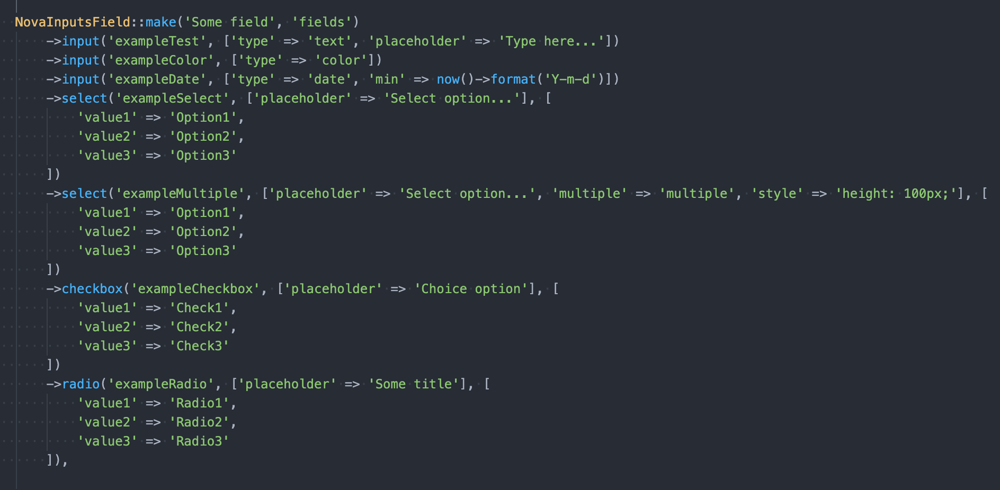
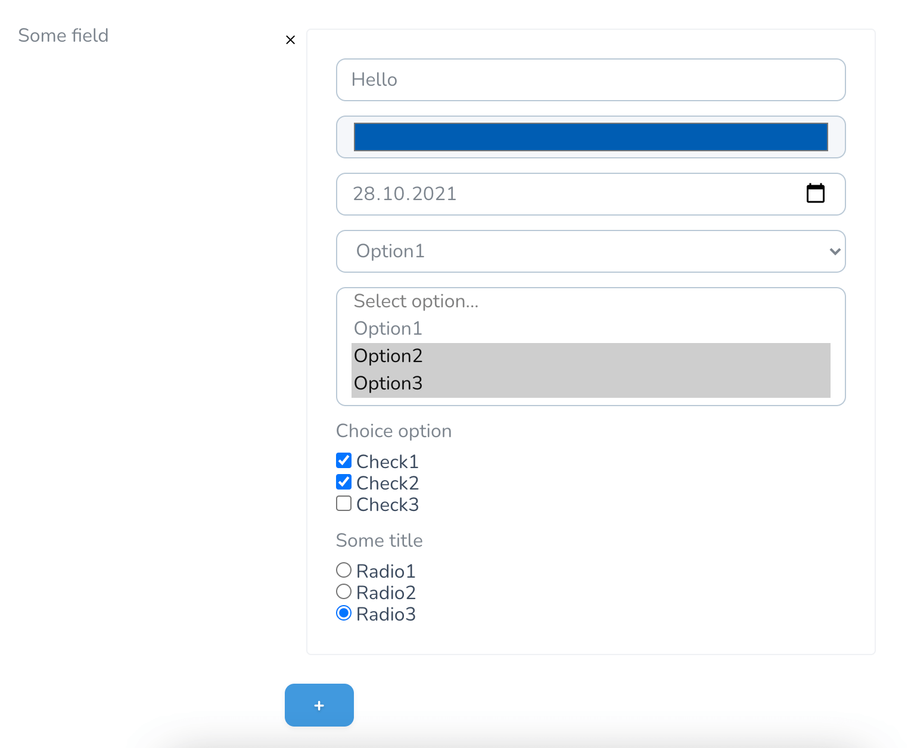
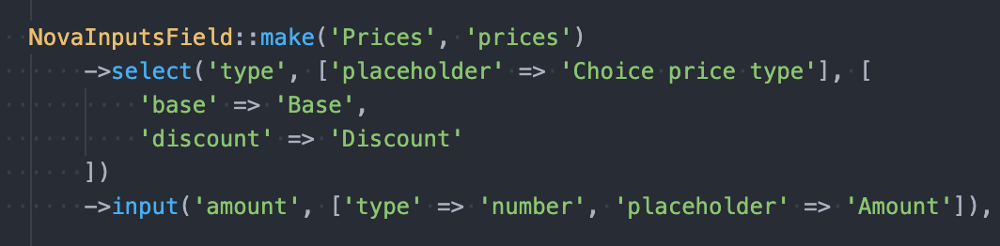
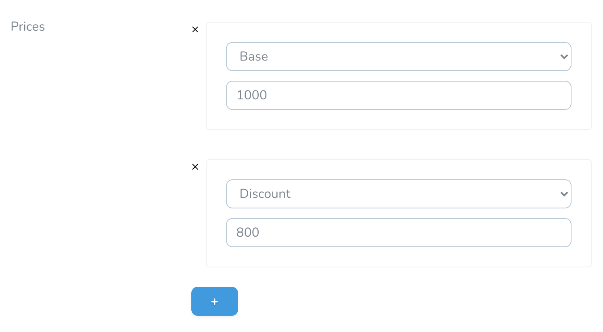

# Nova Inputs Field
Multiple fields based on json for Laravel Nova

- Creating multiple fields based on json
- Custom attributes available
- In the arsenal: Input, Select, Checkbox, Radio

## Requirements

- `php: >=7.1`
- `laravel/nova: ^3.0`

## Screenshots









## Installation

Install via Composer:

```bash
composer require zetrider/nova-inputs-field
```

## Usage

### Database
A field in the database should be based on type text.

For example:

```php
$table->text('fields')->nullable();
// Or
$table->longText('fields')->nullable();
// Or
$table->json('fields')->nullable();
```

The field stores data in json format.

For example:
```json
[{"exampleTest":"Hello","exampleColor":"#005a9e","exampleDate":"2021-10-28","exampleSelect":"value1","exampleMultiple":["value2","value3"],"exampleCheckbox":["value1","value2"],"exampleRadio":"value3"}]
```

Data:
* Key: (string) field key
* Value: (array | string ) - depends on field type and the attribute 'multiple'. Checkbox is always an array.

### Model
Your model should cast field:

```php
/**
    * The attributes that should be cast.
    *
    * @var array
*/
protected $casts = [
    'fields' => 'array',
];
```

### Nova resource

The `NovaInputsField` works like a standard Nova field.

You can use the following methods:
* `input`(string $key, array $attributes)
* `select`(string $key, array $attributes, array $options)
* `checkbox`(string $key, array $attributes, array $options)
* `radio`(string $key, array $attributes, array $options)

`$key` - used as a key in json

`$attributes` - any html attributes supported by the field. The placeholder attribute for checkbox and radio fields is used as a title.

`$options` - options for the field. The array key is value for the option. The array value is the option name.

For example:

```php
use ZetRider\NovaInputsField\NovaInputsField;

public function fields(Request $request)
{
    return [
        NovaInputsField::make('Some field', 'fields')
            // Simple text field
            ->input('exampleTest', ['type' => 'text', 'placeholder' => 'Type here...'])
            // Color field
            ->input('exampleColor', ['type' => 'color'])
            // Date field
            ->input('exampleDate', ['type' => 'date', 'min' => now()->format('Y-m-d')])
            // Simple select
            ->select('exampleSelect', ['placeholder' => 'Select option...'], [
                'value1' => 'Option1',
                'value2' => 'Option2',
                'value3' => 'Option3'
            ])
            // Multiple select
            ->select('exampleMultiple', ['placeholder' => 'Select option...', 'multiple' => 'multiple', 'style' => 'height: 100px;'], [
                'value1' => 'Option1',
                'value2' => 'Option2',
                'value3' => 'Option3'
            ])
            // Checkbox
            ->checkbox('exampleCheckbox', ['placeholder' => 'Choice option'], [
                'value1' => 'Check1',
                'value2' => 'Check2',
                'value3' => 'Check3'
            ])
            // Radio
            ->radio('exampleRadio', ['placeholder' => 'Some title'], [
                'value1' => 'Radio1',
                'value2' => 'Radio2',
                'value3' => 'Radio3'
            ]),
    ];
}
```

or

```php
NovaInputsField::make('Prices', 'prices')
    ->select('type', [], ['base' => 'Base', 'sale' => 'Sale'])
    ->input('price', ['type' => 'nubmer', 'min' => '1', 'step' => '0.01']),
```

## License

This project is open-sourced software licensed under the [MIT license](LICENSE).